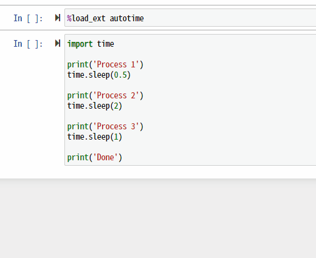

# jupyter-autotime

Display elapsed time on Jupyter.



## Getting start

1. Install
   * On shell.

      ```sh
      pip install jupyter-autotime
      ```

   * On Jupyter.

      ```python
      !pip install jupyter-autotime
      ```

1. Enable autotime

   ```python
   %load_ext autotime
   ```

## Other usage

```python
# Reload.
%reload_ext autotime

# Disable.
%unload_ext autotime
```

## Customization

* Customize timespan format.

   ```python
   import autotime


   def my_format_timepan(timespan: float) -> str):
      """My custom timespan format."""
      # e.g. '12 sec'
      return '{} sec'.format(int(timespan))
   autotime.format_timespan = my_format_timepan
   ```

* Customize output format.

   ```python
   import autotime

   # e.g. '[RUNNING] 3.09 s (2020-12-10T15:58:35)'
   autotime.RUNNING_FORMAT = '[RUNNING] {timespan} ({start})'
   # e.g. '[FINISH] 4.02 s (2020-12-10T15:59:54~2020-12-10T15:59:58)'
   autotime.FINISHED_FORMAT = '[FINISH] {timespan} ({start}~{end})'
   ```

* Customize output with method.

   ```python
   import time


   def my_format_output(timespan: float,
                        start_time: time.struct_time,
                        end_time: float = None,
                        is_finished: bool = False):
      """My Custom output format."""
      if is_finished:
         # e.g. 'Finished. 2.0160000000032596'
         return 'Finished. {}'.format(timespan)
      else:
         # e.g. 'Running... 1.0159999999887077'
         return 'Running... {}'.format(timespan)


   autotime.format_output = my_format_output
   ```

## Development

* Requirements: poetry, pyenv

```sh
poetry install

poetry publish

pip install --no-cache-dir --upgrade jupyter-autotime
```
